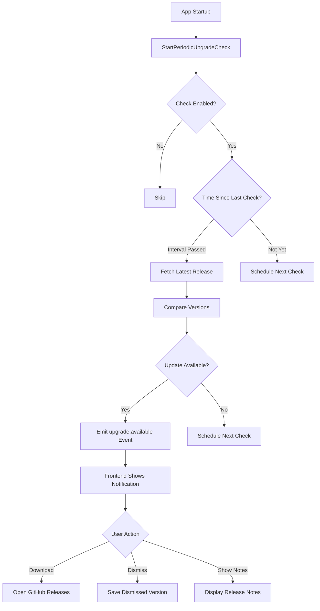

# Upgrade Check Feature Implementation Plan

## Overview

This plan implements automatic upgrade checking functionality that periodically checks GitHub releases for new versions and notifies users when updates are available. The implementation follows existing codebase patterns (handler-based architecture, event-driven updates, theme-compliant UI).

## Architecture



## Implementation Tasks

### Phase 1: Backend - Version Package

#### 1.1 Create Version Package Structure

- **File**: `internal/version/version.go`
    - Define version constants (GitHubOwner: "B87", GitHubRepo: "pubsub-gui")
    - Export `GetVersion()` function that reads from `main.version` (set via ldflags)
    - Export `GetReleasesURL()` function

- **File**: `internal/version/github.go`
    - Implement `FetchLatestRelease()` function
    - Use `http.Client` with 10s timeout
    - Set User-Agent header: `pubsub-gui/{version}`
    - Parse GitHub API response (skip drafts/prereleases)
    - Return `GitHubRelease` struct with tag_name, name, body, html_url, published_at

- **File**: `internal/version/checker.go`
    - Implement `CheckForUpdates()` function
    - Use `github.com/hashicorp/go-version` for semantic version comparison
    - Normalize versions (remove 'v' prefix)
    - Skip check for "dev" builds
    - Return `UpdateInfo` struct

- **File**: `internal/version/models.go`
    - Define `GitHubRelease` struct (JSON tags)
    - Define `UpdateInfo` struct (JSON tags)

#### 1.2 Add Dependency

- **File**: `go.mod`
    - Add: `github.com/hashicorp/go-version v1.6.0`
    - Run `go mod tidy`

### Phase 2: Backend - Configuration Updates

#### 2.1 Update AppConfig Model

- **File**: `internal/models/connection.go`
    - Add to `AppConfig` struct:
    ```go
    AutoCheckUpgrades       bool      `json:"autoCheckUpgrades"`
    UpgradeCheckInterval    int       `json:"upgradeCheckInterval"` // hours
    LastUpgradeCheck        time.Time `json:"lastUpgradeCheck"`
    DismissedUpgradeVersion string    `json:"dismissedUpgradeVersion"`
    ```

    - Update `NewDefaultConfig()` to set defaults:
        - `AutoCheckUpgrades: true`
        - `UpgradeCheckInterval: 24`
        - `LastUpgradeCheck: time.Time{}`
        - `DismissedUpgradeVersion: ""`

#### 2.2 Update ConfigHandler

- **File**: `internal/app/config.go`
    - Add validation in `SaveConfigFileContent()`:
        - Validate `UpgradeCheckInterval` (1-720 hours)
        - Set defaults if invalid

### Phase 3: Backend - App Integration

#### 3.1 Add Upgrade Check Fields to App Struct

- **File**: `app.go`
    - Add to `App` struct:
    ```go
    upgradeCheckMu     sync.Mutex
    lastUpgradeCheck   time.Time
    upgradeCheckTicker *time.Ticker
    ```


#### 3.2 Add Upgrade Check Methods to App

- **File**: `app.go`
    - Implement `GetCurrentVersion() string` - delegate to existing `GetVersion()`
    - Implement `CheckForUpdates() (*version.UpdateInfo, error)`
        - Call `version.CheckForUpdates()`
        - Update `lastUpgradeCheck` timestamp
        - Save to config via `configManager`
        - Return `UpdateInfo`
    - Implement `StartPeriodicUpgradeCheck()`
        - Check if auto-check enabled in config
        - Calculate interval (default 24 hours)
        - Check if enough time passed since last check
        - Schedule initial check or next check
    - Implement `scheduleNextUpgradeCheck(delay time.Duration)`
        - Stop existing ticker if any
        - Use `time.AfterFunc` for delayed check
        - Start periodic ticker after first check
    - Implement `performUpgradeCheck()`
        - Call `CheckForUpdates()`
        - If update available and not dismissed, emit `upgrade:available` event
    - Implement `DismissUpgradeNotification(version string) error`
        - Update config with dismissed version
        - Save config
    - Implement `OpenReleasesPage(url string) error`
        - Use `runtime.BrowserOpenURL(ctx, url)`

#### 3.3 Integrate with Startup

- **File**: `app.go` (in `startup()` method)
    - After handlers initialized, call `a.StartPeriodicUpgradeCheck()`

#### 3.4 Cleanup on Shutdown

- **File**: `app.go` (in `Disconnect()` method)
    - Stop `upgradeCheckTicker` if running
    - Set to nil

### Phase 4: Frontend - Types and Wails Bindings

#### 4.1 Create TypeScript Types

- **File**: `frontend/src/types/upgrade.ts`
    - Define `UpdateInfo` interface:
    ```typescript
    export interface UpdateInfo {
      currentVersion: string;
      latestVersion: string;
      releaseNotes: string;
      releaseUrl: string;
      publishedAt: string;
      isUpdateAvailable: boolean;
    }
    ```

    - Define `UpgradeSettings` interface (for settings UI)

#### 4.2 Generate Wails Bindings

- Run `wails dev` to generate TypeScript bindings for new Go methods:
    - `GetCurrentVersion()`
    - `CheckForUpdates()`
    - `DismissUpgradeNotification(version: string)`
    - `OpenReleasesPage(url: string)`

### Phase 5: Frontend - Upgrade Notification Component

#### 5.1 Create UpgradeNotification Component

- **File**: `frontend/src/components/UpgradeNotification.tsx`
    - Follow React/Tailwind patterns from rules
    - Use semantic CSS variables for all colors (theme-compliant)
    - State management:
        - `updateInfo: UpdateInfo | null`
        - `isVisible: boolean`
        - `showReleaseNotes: boolean`
    - Event listener for `upgrade:available` event
    - UI elements:
        - Fixed position (bottom-right corner)
        - Update icon with accent color
        - Version comparison text
        - Collapsible release notes section
        - "Download Update" button (opens GitHub releases)
        - "Show/Hide Notes" button
        - Dismiss button (X icon)
    - Handlers:
        - `handleDismiss()` - calls `DismissUpgradeNotification()`
        - `handleDownload()` - calls `OpenReleasesPage()`
        - `handleCheckNow()` - manual check (optional, for testing)

#### 5.2 Integrate with App.tsx

- **File**: `frontend/src/App.tsx`
    - Import `UpgradeNotification` component
    - Add `<UpgradeNotification />` to render tree (after other components)

### Phase 6: Frontend - Settings Integration

#### 6.1 Create Upgrade Settings Tab Component

- **File**: `frontend/src/components/Settings/UpgradeTab.tsx`
    - Follow Settings tab pattern (similar to `AppearanceTab.tsx`)
    - State for upgrade settings:
        - `autoCheckUpgrades: boolean`
        - `upgradeCheckInterval: number`
    - UI elements:
        - Checkbox: "Automatically check for upgrades"
        - Select dropdown: Check interval (1, 6, 12, 24, 168 hours)
        - Button: "Check for Updates Now"
        - Display: Last check time (if available)
        - Display: Current version
    - Load settings from config on mount
    - Save settings via `SaveConfigFileContent()` (update JSON)
    - Manual check button calls `CheckForUpdates()` and shows result

#### 6.2 Update SettingsDialog

- **File**: `frontend/src/components/SettingsDialog.tsx`
    - Add "Upgrade" tab to tabs array
    - Import and render `UpgradeTab` component
    - Add tab state management

### Phase 7: Build Configuration

#### 7.1 Update GoReleaser Configuration

- **File**: `.goreleaser.yaml`
    - Update `ldflags` to include version injection for version package:ldflags:
  - -s -w
  - -X main.version={{.Version}}
  - -X internal/version.Version={{.Version}}
  - -X main.commit={{.Commit}}
  - -X main.date={{.Date}}

#### 7.2 Verify Version Injection

- **File**: `internal/version/version.go`
    - Use `main.version` variable (set via ldflags) or fallback to "dev"
    - Ensure `GetVersion()` reads from correct source

### Phase 8: Testing & Documentation

#### 8.1 Unit Tests

- **File**: `internal/version/checker_test.go`
    - Test version comparison logic
    - Test normalization (remove 'v' prefix)
    - Test dev build skipping

- **File**: `internal/version/github_test.go`
    - Mock HTTP client for GitHub API
    - Test response parsing
    - Test error handling

#### 8.2 Integration Testing

- Test upgrade check on app startup
- Test periodic checking with short interval
- Test dismissal persistence
- Test manual check from settings

#### 8.3 Documentation Updates

- **File**: `CLAUDE.md`
    - Add upgrade check section to Backend API Reference
    - Document new events (`upgrade:available`)
    - Document configuration options

## Key Implementation Details

### Version Source

- Version is set via ldflags in `main.go` (already implemented)
- `internal/version` package reads from `main.version` variable
- Fallback to "dev" for development builds

### Event Emission

- Backend emits `upgrade:available` event with `UpdateInfo` payload
- Frontend listens in `UpgradeNotification` component
- Event only emitted if update available and not dismissed

### Configuration Persistence

- Upgrade settings stored in `~/.pubsub-gui/config.json`
- Last check time updated after each check
- Dismissed version stored to prevent re-notification

### Error Handling

- GitHub API failures logged but don't notify user
- Version parsing errors return error to caller
- Network timeouts handled gracefully (10s timeout)

### Security Considerations

- HTTPS-only communication (GitHub API)
- No auto-download (user must click to open browser)
- Version validation using `go-version` library
- User-Agent header set for rate limiting

## Files to Create/Modify

### New Files

- `internal/version/version.go`
- `internal/version/github.go`
- `internal/version/checker.go`
- `internal/version/models.go`
- `internal/version/checker_test.go`
- `internal/version/github_test.go`
- `frontend/src/types/upgrade.ts`
- `frontend/src/components/UpgradeNotification.tsx`
- `frontend/src/components/Settings/UpgradeTab.tsx`

### Modified Files

- `go.mod` (add dependency)
- `internal/models/connection.go` (add config fields)
- `internal/app/config.go` (add validation)
- `app.go` (add methods and fields)
- `main.go` (no changes needed - version already set)
- `.goreleaser.yaml` (update ldflags)
- `frontend/src/App.tsx` (add component)
- `frontend/src/components/SettingsDialog.tsx` (add tab)
- `CLAUDE.md` (documentation)

## Dependencies

### Backend

- `github.com/hashicorp/go-version v1.6.0` (new)

### Frontend

- No new dependencies (uses existing Wails runtime)

## Testing Checklist

- [ ] Version comparison works correctly (semantic versioning)
- [ ] GitHub API integration works (fetch latest release)
- [ ] Periodic checking respects interval setting
- [ ] Notification appears when update available
- [ ] Dismissal prevents re-notification for same version
- [ ] Manual check from settings works
- [ ] Settings UI saves preferences correctly
- [ ] Release notes display correctly
- [ ] Download button opens GitHub releases page
- [ ] Dev builds skip upgrade check
- [ ] Error handling works (network failures, API errors)
- [ ] Theme compliance (all 5 themes tested)

## Rollout Strategy

1. **Phase 1-3**: Backend implementation and testing
2. **Phase 4-6**: Frontend implementation and testing
3. **Phase 7**: Build configuration updates
4. **Phase 8**: Integration testing and documentation
5. **Release**: Merge to main, create release with feature enabled